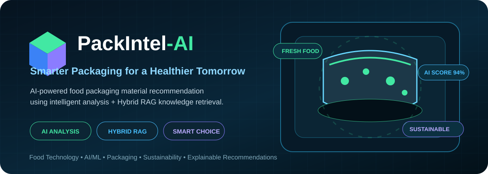

<div align="center">



<br />

[](https://github.com/wwwsahilchand123-maker/PackIntel-AI)
[](https://github.com/wwwsahilchand123-maker/PackIntel-AI)
[](https://github.com/wwwsahilchand123-maker/PackIntel-AI)

### 🧠 Intelligent Food Packaging Material Recommendation System

**Analyze food + storage conditions → retrieve relevant knowledge → compare materials → get an explainable recommendation.**

</div>

---

## 🌱 What is PackIntel-AI?

**PackIntel-AI** is an AI-powered decision-support system for intelligent food packaging material selection. It evaluates food characteristics, storage conditions, shelf-life requirements and sustainability preferences to help identify suitable packaging options.

The project combines recommendation logic with a **Hybrid RAG (Retrieval-Augmented Generation)** workflow so that recommendations can be supported by relevant packaging knowledge and evidence.

> **Important:** PackIntel-AI is a decision-support system. Real-world packaging selection still requires food-contact safety checks, regulatory compliance, migration assessment, machinery compatibility, cost analysis and validated laboratory shelf-life testing.

---

## ✨ Key Features

| Feature | Description |
|---|---|
| 🤖 **AI Recommendations** | Suggests suitable packaging material options from user requirements |
| 🧠 **Hybrid RAG** | Retrieves relevant packaging knowledge for better-supported decisions |
| 📊 **Explainable Scoring** | Breaks down why a material receives its recommendation score |
| ⚖️ **Material Comparison** | Compare packaging alternatives side-by-side |
| 🔬 **What-If Simulator** | Change conditions such as shelf life or sustainability priority and see how recommendations respond |
| 📚 **Evidence Support** | Provides supporting knowledge behind recommendations |
| 🖥️ **Modern UI** | Futuristic web interface designed for practical demonstrations |

---

## ⚡ How It Works

```text
┌──────────────────┐
│   USER INPUT     │
│ Food + Storage   │
│ + Requirements   │
└────────┬─────────┘
         ↓
┌──────────────────┐
│ KNOWLEDGE        │
│ RETRIEVAL        │
│ Hybrid RAG       │
└────────┬─────────┘
         ↓
┌──────────────────┐
│ AI ANALYSIS      │
│ Material fit +   │
│ requirement fit │
└────────┬─────────┘
         ↓
┌──────────────────┐
│ RECOMMENDATION   │
│ Score + Reasons  │
│ + Evidence       │
└────────┬─────────┘
         ↓
┌──────────────────┐
│ SMARTER CHOICE   │
│ Compare / What-If│
└──────────────────┘
```

---

## 🎯 Example Use Case

**Scenario:** Fresh strawberries requiring refrigerated storage and extended shelf life.

The user enters the food and storage requirements, chooses priorities such as sustainability, and runs the analysis. PackIntel-AI processes the requirements, retrieves relevant knowledge, evaluates candidate packaging materials and presents a ranked recommendation with reasoning.

The **Compare** and **What-If** workflows can then be used to understand how changing requirements affects the decision.

---

## 🛠️ Technology Stack

### Backend
- Python
- FastAPI
- Recommendation services
- RAG / retrieval workflow
- Knowledge and evidence processing

### Frontend
- TypeScript / JavaScript
- Modern web UI
- Responsive components
- Data visualization / interactive workflows

### AI & Data
- Retrieval-Augmented Generation concepts
- Embeddings / vector knowledge retrieval
- Packaging knowledge base
- Explainable recommendation logic

---

## 📁 Project Structure

```text
PackIntel-AI/
│
├── backend/          # API + recommendation + RAG services
├── frontend/         # Web application
├── data/             # Project data / knowledge resources
├── models/           # Model-related resources
├── static/           # Static assets
└── README.md         # Project documentation
```

---

## 🚀 Quick Start

### 1. Clone the repository

```bash
git clone https://github.com/wwwsahilchand123-maker/PackIntel-AI.git
cd PackIntel-AI
```

### 2. Backend setup

```bash
cd backend
python -m venv .venv
```

Activate the environment and install the dependencies:

```bash
pip install -r requirements.txt
```

### 3. Frontend setup

```bash
cd frontend
npm install
```

Use the scripts defined in `frontend/package.json` to start the development server.

> Configuration such as API keys or environment variables should be supplied through local environment files and should **not** be committed to GitHub.

---

## 🔍 Why This Project Matters

Food packaging directly affects **food safety, shelf life, food waste, cost and environmental impact**. Selecting a material involves balancing several technical requirements rather than choosing a material based on a single factor.

PackIntel-AI demonstrates how AI-assisted retrieval and explainable decision support can bring these factors together in one software workflow.

---

## 🔮 Future Scope

- Larger packaging-material knowledge base
- More food commodities and storage scenarios
- Advanced lifecycle / sustainability analysis
- Regulatory and food-contact compliance modules
- Cost and supply-chain optimization
- Improved model evaluation and recommendation benchmarking
- Deployment as an industry-facing decision-support platform

---

## ⚠️ Disclaimer

This project is intended for **academic, research and decision-support purposes**. Its recommendations should not be treated as a substitute for certified food-contact testing, regulatory assessment, packaging engineering, or laboratory shelf-life validation.

---

<div align="center">

### 🌿 Good Food · Smart Packaging · Sustainable Future

**Built with ❤️ by Sahil Chand**

⭐ If you find the project interesting, consider starring the repository.

</div>
