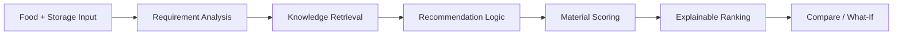

<div align="center">


[](https://github.com/wwwsahilchand123-maker/PackIntel-AI)
[](https://github.com/wwwsahilchand123-maker/PackIntel-AI)
[](https://github.com/wwwsahilchand123-maker/PackIntel-AI)

### 🧠 Intelligent Food Packaging Material Recommendation System

**Analyze food + storage conditions → retrieve knowledge → score materials → explain the recommendation.**

</div>

---

## 🌱 What is PackIntel-AI?

PackIntel-AI is an AI-powered decision-support system for food packaging material selection. It combines requirement analysis, retrieval and recommendation logic to compare packaging options against food characteristics, storage conditions, shelf-life goals and sustainability preferences.

> **Important:** recommendations are decision support, not a substitute for food-contact safety assessment, regulatory compliance, migration testing, machinery compatibility, cost analysis or validated shelf-life studies.

## ✨ Core Features

| Feature | Purpose |
|---|---|
| 🤖 AI Recommendations | Rank packaging material options against requirements |
| 🧠 Hybrid RAG | Retrieve relevant packaging knowledge |
| 📊 Explainable Scoring | Show the reasoning behind recommendation scores |
| ⚖️ Material Comparison | Compare alternatives side-by-side |
| 🔬 What-If Simulator | Explore how requirement changes affect results |
| 📚 Evidence Support | Connect recommendations with supporting knowledge |
| 🖥️ Interactive UI | Present the workflow as a modern web experience |

## ⚡ Decision Pipeline



## 🎯 Example

```text
Fresh strawberries
        +
Refrigerated storage
        +
Extended shelf-life goal
        +
Sustainability priority
        ↓
Knowledge retrieval + material evaluation
        ↓
Ranked recommendation + explanation
```

## 🛠️ Technology Stack

**Backend:** Python • FastAPI • Recommendation Services • RAG / Retrieval Workflow  
**Frontend:** TypeScript / JavaScript • Modern Web UI  
**AI & Data:** Retrieval-Augmented Generation • Embeddings / Vector Retrieval • Packaging Knowledge • Explainable Recommendation Logic

## 📁 Project Structure

```text
PackIntel-AI/
├── backend/      # API + recommendation + RAG services
├── frontend/     # Web application
├── data/         # Data / knowledge resources
├── models/       # Model-related resources
├── static/       # Static assets
└── README.md
```

## 🚀 Quick Start

```bash
git clone https://github.com/wwwsahilchand123-maker/PackIntel-AI.git
cd PackIntel-AI
```

Backend:

```bash
cd backend
python -m venv .venv
pip install -r requirements.txt
```

Frontend:

```bash
cd frontend
npm install
```

Use the scripts in `frontend/package.json` to start the development server. Keep API keys and local environment values out of Git.

## 🔬 Evaluation Roadmap

A recommendation system should eventually be evaluated with reproducible test cases rather than only screenshots.

- [ ] Benchmark recommendation quality on curated scenarios
- [ ] Add retrieval relevance evaluation
- [ ] Measure recommendation consistency
- [ ] Add explainability / evidence coverage checks
- [ ] Expand commodity and storage-condition coverage

## 🔮 Future Scope

- Larger packaging knowledge base
- More food commodities and storage scenarios
- Lifecycle and sustainability analysis
- Regulatory and food-contact compliance modules
- Cost and supply-chain optimization
- Industry-facing deployment

## ⚠️ Disclaimer

PackIntel-AI is intended for academic, research and decision-support purposes. Real-world packaging decisions require professional engineering, regulatory assessment, food-contact testing and validated shelf-life studies.

---

<div align="center">

### 🌿 GOOD FOOD · SMART PACKAGING · SUSTAINABLE FUTURE

⭐ **Star the repo if the idea is useful.**

**Built by Sahil Chand**

</div>
