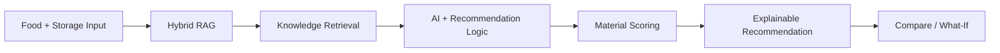

<div align="center">


[](https://github.com/wwwsahilchand123-maker/PackIntel-AI)
[](https://github.com/wwwsahilchand123-maker/PackIntel-AI)
[](https://github.com/wwwsahilchand123-maker/PackIntel-AI)

### 🧠 Intelligent Food Packaging Material Recommendation System

**Analyze food + storage conditions → retrieve relevant knowledge → compare materials → get an explainable recommendation.**

</div>

---

## 🌱 What is PackIntel-AI?

PackIntel-AI is an AI-powered decision-support system for intelligent food packaging material selection. It evaluates food characteristics, storage conditions, shelf-life requirements and sustainability preferences to help identify suitable packaging options.

The project combines recommendation logic with a **Hybrid RAG (Retrieval-Augmented Generation)** workflow so recommendations can be supported by relevant packaging knowledge and evidence.

> **Important:** This is decision support—not a replacement for food-contact safety checks, regulatory compliance, migration assessment, machinery compatibility, cost analysis or validated laboratory shelf-life testing.

## ✨ Key Features

| Feature | Description |
|---|---|
| 🤖 AI Recommendations | Suggests suitable packaging material options from requirements |
| 🧠 Hybrid RAG | Retrieves relevant packaging knowledge |
| 📊 Explainable Scoring | Shows why a material receives its recommendation score |
| ⚖️ Material Comparison | Compare packaging alternatives side-by-side |
| 🔬 What-If Simulator | Test how changing requirements affects recommendations |
| 📚 Evidence Support | Provides supporting knowledge behind recommendations |
| 🖥️ Futuristic UI | Interactive web experience for demonstrations |

## ⚡ How It Works



## 🎯 Example Use Case

**Fresh strawberries + refrigerated storage + extended shelf life + sustainability priority** → the system analyzes the requirements, retrieves relevant knowledge, evaluates candidate materials and presents a ranked recommendation with reasoning.

## 🛠️ Technology Stack

**Backend:** Python • FastAPI • Recommendation Services • RAG / Retrieval Workflow  
**Frontend:** TypeScript / JavaScript • Modern Web UI • Interactive Workflows  
**AI & Data:** Retrieval-Augmented Generation • Embeddings / Vector Retrieval • Packaging Knowledge • Explainable Recommendation Logic

## 📁 Project Structure

```text
PackIntel-AI/
├── backend/      # API + recommendation + RAG services
├── frontend/     # Web application
├── data/         # Data / knowledge resources
├── models/       # Model-related resources
├── static/       # Static assets
└── README.md
```

## 🚀 Quick Start

```bash
git clone https://github.com/wwwsahilchand123-maker/PackIntel-AI.git
cd PackIntel-AI
```

Backend:

```bash
cd backend
python -m venv .venv
pip install -r requirements.txt
```

Frontend:

```bash
cd frontend
npm install
```

Use the scripts defined in `frontend/package.json` to start the development server. Keep API keys and local environment values out of GitHub.

## 🔮 Future Scope

- Larger packaging-material knowledge base
- More food commodities and storage scenarios
- Advanced lifecycle / sustainability analysis
- Regulatory and food-contact compliance modules
- Cost and supply-chain optimization
- Recommendation benchmarking and evaluation
- Industry-facing deployment

## ⚠️ Disclaimer

PackIntel-AI is intended for academic, research and decision-support purposes. Real-world packaging decisions require professional engineering, regulatory assessment, food-contact testing and validated shelf-life studies.

---

<div align="center">

### 🌿 Good Food · Smart Packaging · Sustainable Future

⭐ **Star the repo if you like the idea.**

**Built with ❤️ by Sahil Chand**

</div>
